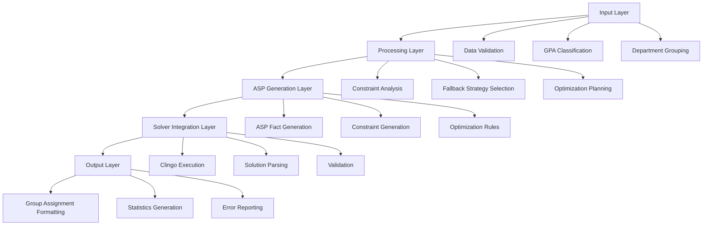

# Design Document: ASP-based Student Group Formation System

## Overview

The ASP-based Student Group Formation System leverages Answer Set Programming (ASP) through the Clingo solver to automatically create balanced student groups for final-year project supervision. The system transforms student data into ASP constraints, solves them using Clingo, and returns validated group assignments that maximize academic balance while respecting departmental boundaries.

The core design follows a pipeline architecture:
1. **Input Processing**: Validate and classify student data by GPA tiers
2. **ASP Generation**: Convert student data and constraints into ASP program syntax
3. **Solver Integration**: Execute Clingo solver with generated ASP program
4. **Solution Parsing**: Extract and validate group assignments from solver output
5. **Output Formatting**: Return structured group assignments with statistics

## Architecture

The system follows a layered architecture with clear separation of concerns:



### Key Architectural Principles

1. **Separation of Concerns**: Each layer has a single responsibility
2. **Constraint-Based Design**: All business rules expressed as ASP constraints
3. **Fallback Strategy Hierarchy**: Graceful degradation when ideal solutions impossible
4. **Validation at Boundaries**: Input validation and output verification
5. **Solver Abstraction**: Clean interface to Clingo solver with error handling

## Components and Interfaces

### 1. Student Data Processor

**Responsibility**: Validate, classify, and organize student input data

```typescript
interface StudentDataProcessor {
  validateStudentData(students: RawStudent[]): ValidationResult
  classifyByGPATier(students: Student[]): TierClassification
  groupByDepartment(students: Student[]): Map<string, Student[]>
}

interface Student {
  name: string
  gpa: number
  department: string
  tier: GPATier
}

enum GPATier {
  HIGH = "HIGH",    // 3.80 - 5.00
  MEDIUM = "MEDIUM", // 3.30 - 3.79
  LOW = "LOW"       // 0.00 - 3.29
}
```

### 2. ASP Program Generator

**Responsibility**: Convert student data and business rules into ASP program syntax

```typescript
interface ASPProgramGenerator {
  generateStudentFacts(students: Student[]): string
  generateGroupingConstraints(studentCount: number): string
  generateOptimizationRules(tierCounts: TierCounts): string
  generateCompleteProgram(students: Student[]): ASPProgram
}

interface ASPProgram {
  facts: string
  constraints: string
  optimization: string
  complete: string
}
```

### 3. Clingo Solver Interface

**Responsibility**: Execute ASP programs using Clingo and parse results

```typescript
interface ClingoSolver {
  solve(aspProgram: string): SolverResult
  parseAnswerSet(rawOutput: string): GroupAssignment[]
  validateSolution(assignments: GroupAssignment[], students: Student[]): boolean
}

interface SolverResult {
  success: boolean
  answerSets: string[]
  error?: string
  executionTime: number
}
```

### 4. Group Formation Engine

**Responsibility**: Orchestrate the entire group formation process

```typescript
interface GroupFormationEngine {
  formGroups(students: Student[]): GroupFormationResult
  calculateOptimalStrategy(tierCounts: TierCounts): FormationStrategy
  applyFallbackStrategies(students: Student[], strategy: FormationStrategy): GroupAssignment[]
}

interface GroupFormationResult {
  success: boolean
  groups: Group[]
  statistics: FormationStatistics
  error?: string
}
```

### 5. Fallback Strategy Manager

**Responsibility**: Handle non-ideal group formations when perfect balance is impossible

```typescript
interface FallbackStrategyManager {
  determineFallbackNeeded(tierCounts: TierCounts): boolean
  selectFallbackStrategy(tierCounts: TierCounts): FallbackStrategy
  generateFallbackConstraints(strategy: FallbackStrategy): string
}

enum FallbackStrategy {
  INSUFFICIENT_LOW,    // 1H + 2M + 0L
  INSUFFICIENT_HIGH,   // 0H + 1M + 2L  
  INSUFFICIENT_MEDIUM, // 2H + 0M + 1L
  MIXED_DEFICIENCY     // Multiple strategies combined
}
```

## Data Models

### Core Data Structures

```typescript
// Input data model
interface RawStudent {
  name: string
  gpa: number | string
  department: string
}

// Processed student model
interface Student {
  id: string
  name: string
  gpa: number
  department: string
  tier: GPATier
}

// Group assignment model
interface Group {
  id: string
  students: Student[]
  composition: GroupComposition
  isIdeal: boolean
}

interface GroupComposition {
  highCount: number
  mediumCount: number
  lowCount: number
}

// Tier distribution analysis
interface TierCounts {
  high: number
  medium: number
  low: number
  total: number
}

// Formation strategy model
interface FormationStrategy {
  idealGroups: number
  fallbackGroups: FallbackGroupType[]
  remainderHandling: RemainderStrategy
}

interface FallbackGroupType {
  type: FallbackStrategy
  count: number
  composition: GroupComposition
}

// Results and statistics
interface FormationStatistics {
  totalStudents: number
  totalGroups: number
  idealGroups: number
  fallbackGroups: number
  departmentBreakdown: Map<string, DepartmentStats>
}

interface DepartmentStats {
  studentCount: number
  groupCount: number
  tierDistribution: TierCounts
  idealGroupPercentage: number
}

// ASP-specific models
interface ASPFact {
  predicate: string
  arguments: string[]
}

interface ASPConstraint {
  type: 'hard' | 'soft'
  rule: string
  priority?: number
}

// Error handling models
interface ValidationError {
  field: string
  value: any
  message: string
  code: string
}

interface GroupFormationError {
  type: 'validation' | 'solver' | 'constraint' | 'system'
  message: string
  details?: any
  suggestions?: string[]
}
```

### ASP Program Structure

The generated ASP program follows this structure:

```prolog
% Student facts
student(student_1, "John Doe", high, "SE").
student(student_2, "Jane Smith", medium, "SE").
student(student_3, "Bob Johnson", low, "SE").

% Group assignment predicates
group(G, S1, S2, S3) :- 
    student(S1, _, T1, D), student(S2, _, T2, D), student(S3, _, T3, D),
    S1 < S2, S2 < S3,
    G = group_id.

% Hard constraints
:- group(G, S1, S2, S3), group(G2, S1, _, _), G != G2.  % No student in multiple groups
:- student(S, _, _, _), not assigned(S).                 % All students must be assigned

% Optimization (prefer ideal groups)
ideal_group(G) :- group(G, S1, S2, S3), 
    student(S1, _, high, D), student(S2, _, medium, D), student(S3, _, low, D).

#maximize { 1@2 : ideal_group(G) }.
```

### Database Integration Model

```typescript
// Database interface for student data retrieval
interface StudentRepository {
  getStudentsByDepartment(department: string): Promise<Student[]>
  getAllStudents(): Promise<Student[]>
  validateStudentExists(studentId: string): Promise<boolean>
}

// Database interface for group storage
interface GroupRepository {
  saveGroupAssignments(groups: Group[]): Promise<void>
  getGroupsByDepartment(department: string): Promise<Group[]>
  clearExistingGroups(department: string): Promise<void>
}
```

## Correctness Properties

*A property is a characteristic or behavior that should hold true across all valid executions of a system—essentially, a formal statement about what the system should do. Properties serve as the bridge between human-readable specifications and machine-verifiable correctness guarantees.*

Based on the requirements analysis, the following correctness properties ensure the system behaves correctly across all valid inputs:

### Property 1: GPA Classification Correctness
*For any* valid GPA value, the system should classify it into the correct tier (HIGH: 3.80-5.00, MEDIUM: 3.30-3.79, LOW: 0.00-3.29) and reject invalid values with descriptive errors
**Validates: Requirements 1.2, 1.3, 1.4**

### Property 2: Student Data Validation Completeness  
*For any* student record, the system should validate that all required fields (name, GPA, department) are present and properly formatted
**Validates: Requirements 1.1, 9.1**

### Property 3: Departmental Isolation
*For any* multi-department student population, the system should process each department independently and never place students from different departments in the same group
**Validates: Requirements 7.1, 7.2, 7.3, 7.5**

### Property 4: Complete Assignment Guarantee
*For any* valid student population, every student should be assigned to exactly one group with no duplicates or omissions
**Validates: Requirements 6.1, 6.4, 6.5**

### Property 5: Group Size Consistency
*For any* generated group assignment, every group should contain exactly 3 students
**Validates: Requirements 2.2, 6.2**

### Property 6: Ideal Group Maximization
*For any* student population where ideal groups are possible, the system should create the maximum number of ideal groups (1 HIGH + 1 MEDIUM + 1 LOW) before applying fallback strategies
**Validates: Requirements 4.1, 4.2, 4.3, 4.4, 4.5**

### Property 7: Fallback Strategy Correctness
*For any* student population requiring fallback strategies, the system should apply the correct fallback composition based on tier deficiencies and ensure no students remain ungrouped
**Validates: Requirements 5.1, 5.2, 5.3, 5.4, 5.5**

### Property 8: ASP Program Generation Validity
*For any* student dataset, the generated ASP program should have valid syntax and contain all necessary facts, constraints, and optimization rules
**Validates: Requirements 2.1, 2.3, 2.4, 2.5, 10.1, 10.3**

### Property 9: Clingo Integration Robustness
*For any* ASP program, the system should correctly invoke Clingo, parse solutions, validate results, and handle solver errors gracefully
**Validates: Requirements 3.1, 3.2, 3.3, 3.4, 3.5, 9.2, 10.2, 10.4**

### Property 10: Output Format Completeness
*For any* successful group formation, the output should include all required information (student details, group compositions, statistics) in a structured format suitable for database storage
**Validates: Requirements 8.2, 8.3, 8.4**

### Property 11: Constraint Satisfaction Validation
*For any* returned group assignment, all hard constraints (group size, complete assignment, departmental boundaries) should be satisfied
**Validates: Requirements 8.1, 8.5**

### Property 12: Error Handling Comprehensiveness
*For any* invalid input or system failure condition, the system should return specific, descriptive error messages that help identify and resolve the problem
**Validates: Requirements 9.3, 9.4, 9.5**

### Property 13: Round-trip Data Integrity
*For any* valid student dataset, the complete workflow (data → ASP program → Clingo → parsed results → validated output) should preserve all essential student information and satisfy all business constraints
**Validates: Requirements 10.5**

### Property 14: Minimum Department Size Enforcement
*For any* department with fewer than 3 students, the system should return a descriptive error and not attempt group formation for that department
**Validates: Requirements 7.4, 9.3**

## Error Handling

The system implements comprehensive error handling at multiple levels:

### Input Validation Errors
- **Missing Required Fields**: Clear indication of which fields are missing
- **Invalid GPA Values**: Specific error for out-of-range or non-numeric GPAs  
- **Empty Datasets**: Graceful handling with appropriate messaging
- **Insufficient Department Size**: Descriptive error when departments have < 3 students

### ASP Generation Errors
- **Syntax Validation**: Pre-validation of generated ASP programs
- **Constraint Conflicts**: Detection of unsatisfiable constraint combinations
- **Optimization Rule Errors**: Validation of optimization rule syntax

### Solver Integration Errors
- **Clingo Unavailable**: Clear error when solver dependency is missing
- **Solver Timeout**: Appropriate handling of long-running solver executions
- **Unsatisfiable Constraints**: Informative error when no solution exists
- **Parsing Failures**: Graceful handling of malformed solver output

### Validation Errors
- **Constraint Violations**: Detailed reporting of which constraints are violated
- **Assignment Completeness**: Detection of incomplete or duplicate assignments
- **Data Integrity**: Validation that output matches input expectations

### Error Response Format
```typescript
interface SystemError {
  type: 'validation' | 'solver' | 'constraint' | 'system'
  code: string
  message: string
  details: {
    field?: string
    value?: any
    constraint?: string
    suggestion?: string
  }
  timestamp: string
}
```

## Testing Strategy

The system employs a dual testing approach combining unit tests for specific scenarios and property-based tests for comprehensive coverage:

### Unit Testing Focus
- **Specific Examples**: Test known good and bad inputs with expected outputs
- **Edge Cases**: Department boundaries, remainder students, minimum populations
- **Integration Points**: ASP generation, Clingo invocation, result parsing
- **Error Conditions**: Invalid inputs, solver failures, constraint violations

### Property-Based Testing Configuration
- **Testing Library**: Use fast-check for TypeScript/JavaScript or Hypothesis for Python
- **Minimum Iterations**: 100 iterations per property test to ensure comprehensive coverage
- **Test Tagging**: Each property test tagged with format: **Feature: asp-group-formation, Property {number}: {property_text}**

### Property Test Implementation Requirements
- Each correctness property must be implemented as a single property-based test
- Tests should generate random student populations with varying characteristics:
  - Different department distributions
  - Various GPA tier balances  
  - Edge cases (minimum sizes, perfect balance, severe imbalances)
- Property tests validate universal correctness across all generated inputs
- Unit tests complement by testing specific known scenarios and integration points

### Test Data Generation Strategy
```typescript
// Example property test structure
test('Property 4: Complete Assignment Guarantee', () => {
  fc.assert(fc.property(
    studentPopulationGenerator(), // Generates random valid student populations
    (students) => {
      const result = groupFormationEngine.formGroups(students);
      
      if (result.success) {
        // Every student should appear exactly once
        const assignedStudents = result.groups.flatMap(g => g.students);
        expect(assignedStudents).toHaveLength(students.length);
        expect(new Set(assignedStudents.map(s => s.id))).toHaveLength(students.length);
      }
    }
  ), { numRuns: 100 });
});
```

### Coverage Requirements
- **Unit Tests**: Cover all public API methods, error paths, and integration points
- **Property Tests**: Validate all 14 correctness properties with comprehensive input generation
- **Integration Tests**: End-to-end workflows with real Clingo solver
- **Performance Tests**: Validate reasonable execution times for large student populations